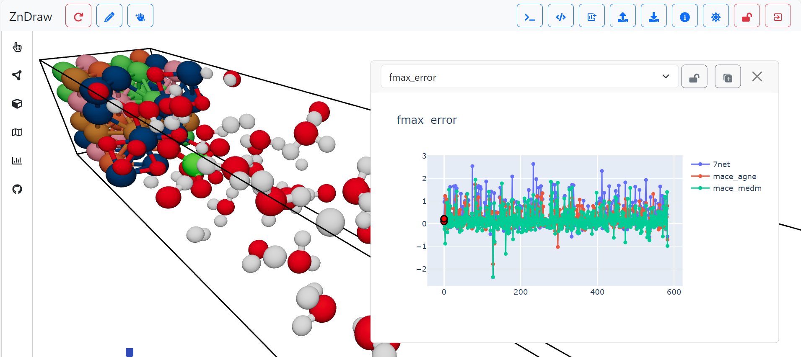

Concept
=======

:code:`mlipx` is designed for evaluating the performance of :term:`MLIP`.
Therefore, :code:`mlipx` provides you with static and dynamic test recipes to evaluate, which mlip you should use for your specific problem.

The :code:`mlipx` package is designed to be modular and extensible. This is realized by utilizing the Data as Code concept via :term:`ZnTrack`.

Static Tests
------------

Predefined datasets for evaluating new :term:`MLIP` for a comparison of their general performance for specific tasks.

Dynamic Tests
-------------

Select the dataset you are interested in and evaluate the available :term:`MLIP` on it.

Comparison
----------
To efficiently compare different models, mlipx integrated with :term:`ZnDraw` to allow and interactive evaluation of produces figures alongside the atomistic structures.

.. .. video:: _static/mlipx_compare_zndraw_nebs.mp4
..     :nocontrols:
..     :loop:
..     :width: 400
..     :autoplay:

In addition, metrics can be logged to :term:`mlflow` giving the user a quick overview of all past evaluations and aid the comparison of different model metrics.

.. image:: _static/mlflow_compare.png
    :width: 80%

.. toctree::

    concept/data
    concept/models
    concept/recipes
    concept/zntrack
    concept/zndraw
    concept/distributed
